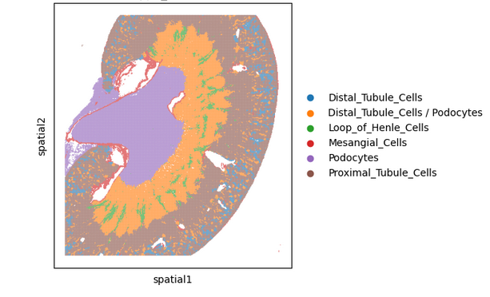

# Spatial Transcriptomics of Mouse Kidney

## Overview
This repository contains analysis and visualization workflows for spatial transcriptomics data
from mouse kidney tissue. The project aims to map gene expression profiles in a healthy mouse kidney spatially
to understand spatial organization and cellular heterogeneity of the kidney.

## Data Source

## Workflow
- Reading and Exploration of data
- Quality Control and Preprocessing of data
- Spatially variable genes(Dimensionality reduction)
- Spatial Domains (Clustering)
- Functional Analysis
- Neighborhood Enrichment

## Dependencies
```bash
pip install -r requirements.txt
```
## Visualizations of Spatial Domains



